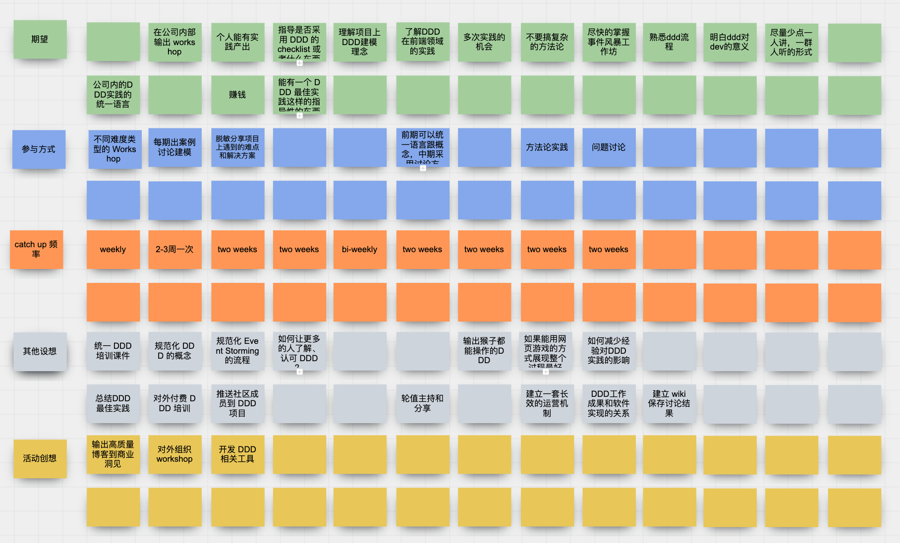
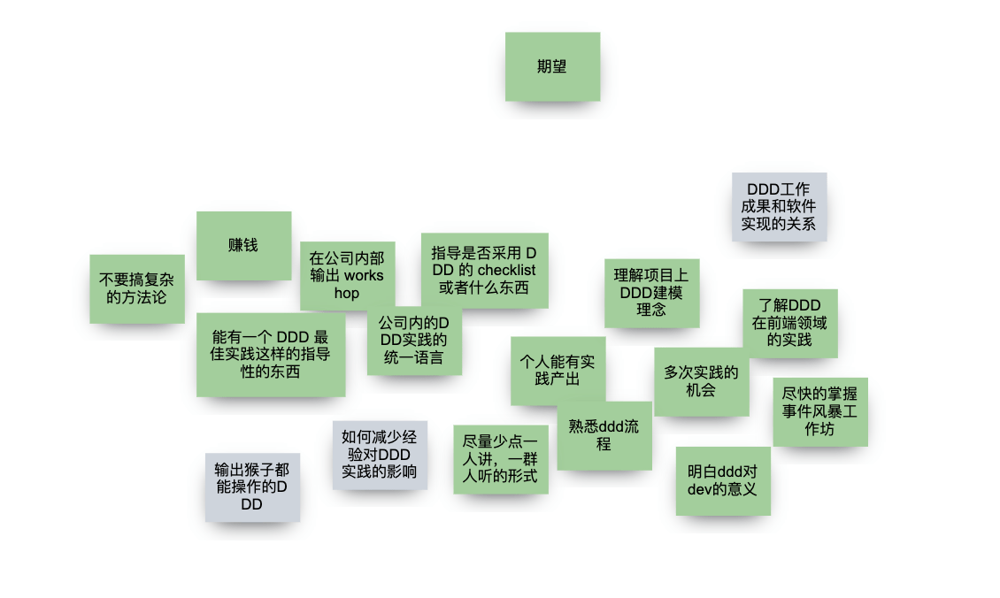
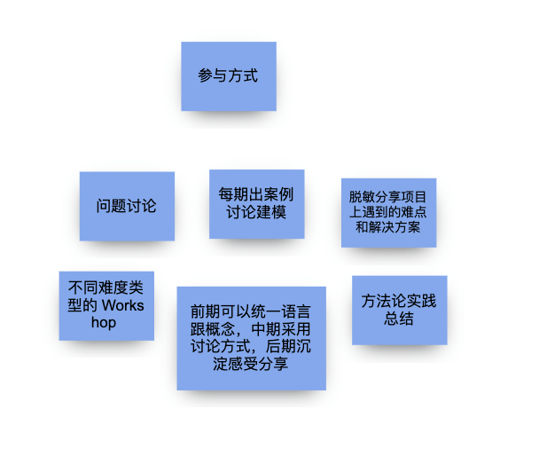
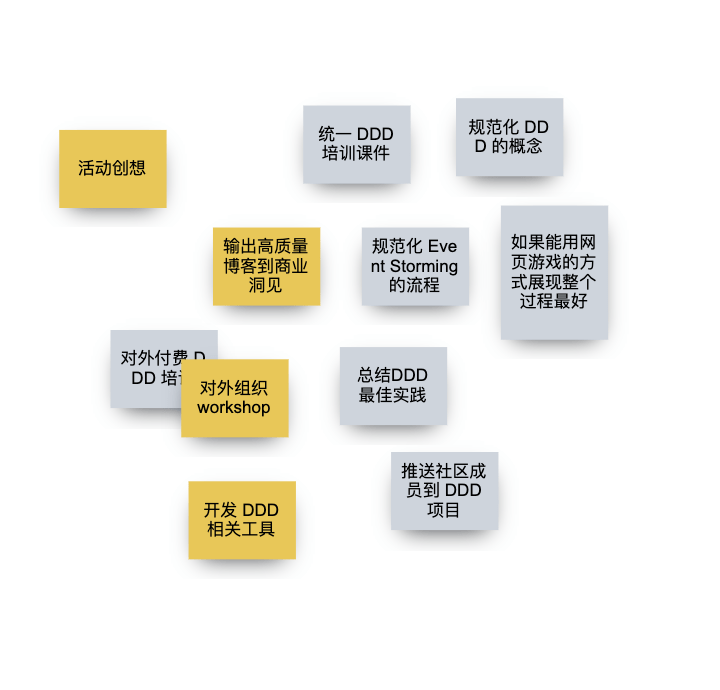
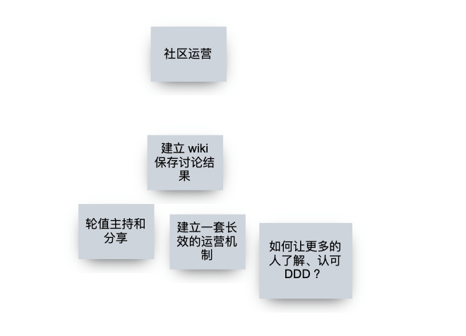
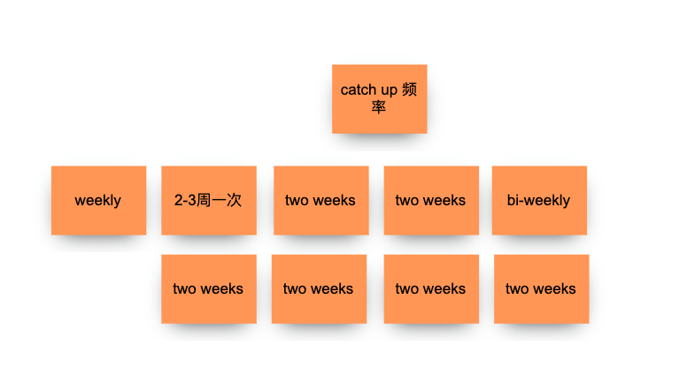
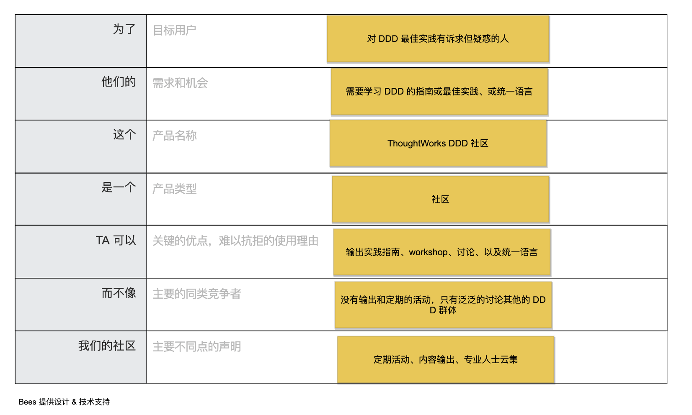

您是否对 DDD 充满疑惑？

大家都说 DDD 好，DDD 怎么好呢，我怎么用起来各种问题？

DDD 的原则中要求开发和业务统一语言，但是 DDD 复杂的概念我们自己怎么没能统一？

DDD 到底怎么在项目中实践？

Event Storming 有没有参考指南？

……

我们带着这些疑问成立了一个 base 成都的小社区，只想做一点小小的事情的 —— 统一下 DDD 的语言，实事求是的用 DDD 改进软件设计实践。

我想学习过 DDD 的同事都有这些问题，于是加入这个社群的人越来越多，有来自一线交付的 MU、咨询等同事。

我们开始了一个 kick off 大家首次见面。

## 通过线上协作软件，我们进行了头脑风暴。

## 分类总结后

## 为了让社区定位明确，我们做了电梯演讲

## 如果你对 ThoughtWorks DDD 社区有兴趣，可以扫描二维码加入

## 鸣谢

- ThoughtWorks 社区运营团队
- Bees 团队赞助的 BeeArt 协作软件 https://beeart.hello-bees.com/