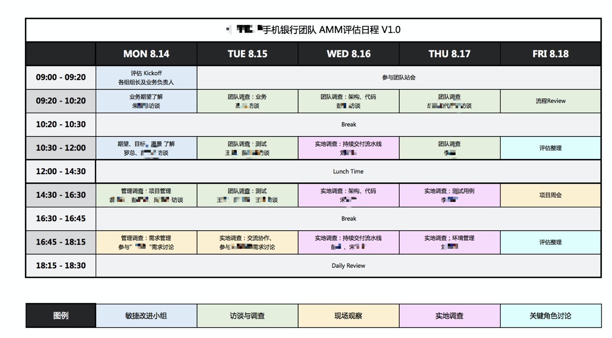

## 模型

- 解决的问题是对已经实施了敏捷的组织进行评估，并给出建议

- 每个维度具有 6 个级别，评估维度 6 个，以及参考基线，包括一些指标的最小集。
  - 组织架构

    - 团队
      - 是否是特性团队
      - 团队人数
      - 团队不同角色人员职责是否清晰
        - BA
        - QA
        - DEV
        - PM
        - UX
    - 考核目标
      - 团队成员的汇报路线是否一致
      - 团队成员是否统一考核，有一致的目标
      - 团队责任是否共通承担
    - 人员梯队
      - 人员建设是否具有梯队性，PM、Tech lead 调动是否有破坏性的影响
      - 团队成员是否有明确的发展方向和路线

  - 产品需求分析
    
    - 产品是否有明确的调研分析实践
      - 包括竞品分析
      - 市场分析
      - 客户群定位
      - 痛点分析
      - 用户画像
      - 可量化和验证的目标
      - 产品发展里程碑
    - 是否对产品有反馈机制
      - 用户测试
      - 根据运营数据调整
    - 是否会以 MVP 快速验证产品
    - 是否有度量，是否以度量驱动开发
    
  - 交付迭代管理

    - 需求管理
      - 业务方是否参与迭代过程，并及时给出反馈
      - 使用用户故事传递需求，并有明确的验收条件
      - 验收条件和测试对齐
      - 使用电子工具管理
    - 敏捷计划
      - 是否以迭代的形式交付
      - 每个迭代有明确的交付计划和目标
      - 所有的需求（变更）都是通过单一的Product Backlog来管理
      - 需求/任务按照业务价值排序，并可动态调整
    - 迭代交付
      - 以何种频率进行产品发布
      - 迭代过程中有明确的DoD，团队成员可以遵守DoD去协作
      - 相对稳定的迭代速率
    - 可视化
      - 团队的工作目标，任务可视化，且在每个迭代更新
      - 迭代中的风险、依赖等问题和图表可视化，且经常更新
      - 迭代速率可视化
      - 工程实践结果通过可视化方式进行展现

  - 技术实践

    - 设计和开发
      - 团队已经制定了编码规范并且能够执行
      - 定期列出技术债，并排优先级，在日常工作中偿还技术债
      - 有明确的接口技术规范。例如RESTful
      - 跨模块/团队开发时，有接口设计文档，并且有版本化管理
    - 代码评审
      - 有代码评审活动
      - 代码检查单，用于自查
      - 代码评审结果中的问题能够被及时修复

    - 持续集成
      - 代码静态分析工具是否整合在持续集成工具上
      - 提交后进行自动的构建与测试
      - CI 构建失败问题，开发团队能够第一时间修复
      - 配置、脚本、测试代码等代码是否全部代码化
      - 基础设施是否足够自动化
      - 基于主干的开发，并小步提交
    - 持续部署
      - 滚动发布
      - 金丝雀发布（蓝绿部署）
      -  每个环节有健康检查，健康检查不通过自动回滚，部署失败
    - 质量保证
      - 代码静态分析
      - 测试参与整个迭代周期
      - 测试是否有用例产出
      - 单元测试
      - API 测试
      - 自动 E2E 测试
      - 性能测试

  - 团队文化
    - 持续改进
      - 敏捷运作过程中有对浪费项的识别和分析
      - 每个迭代执行回顾会，并识别改进措施
      - 业务目标/研发效率/研发质量（JIT）度量并制定改进目标
      - 进行周期性的目标设定和改进，例如缺陷密度值
    - 交流分享
      - 在部落内/小组内定期贡献话题分享
    - 职责共享
      - 成员明确自己和其他成员的任务瓶颈，并主动上报
      - 团队成员主动参与各种日常活动，并积极提供建议
      - 代码公有制，主动修复 CI
    
  - 沟通和协作
    - 会议
      - 站会能否高效完成
      - 回顾会议是否有明确改进项目，并被监督执行
      - 计划会议是否提前准备
      - 需求澄清会议是否关键角色都有参加
    - 沟通
      - 是否是以特性团队的方式沟通和协作，重沟通轻文档
      - 面对面沟通，BA-DEV-QA 都坐在一起
    - 知识传递
      - 知识沉淀，通过 wiki 平台维护各种文档
      - 是否有 onboarding 培训
      - 测试用例是否能持续更新和维护
      - 项目 readme 是否详细

- 成熟度分级

  - 5 理想，团队已经能自主持续优化
  - 4 成熟，团队运行的非常好
  - 3 良好，团队能稳定运行，但是还有改进空间
  - 2 一般，团队满足部分敏捷要求，依然需要改进
  - 1 不足，团队已经有一些敏捷工作方式，存在较多问题
  - 0 初始，没有任何敏捷实践

- 诊断的方法
  - 定量
    - 人员访谈
    - 实地实物考察
  - 定性
    - 问卷调查表
    - 数据收集
  
- 输出件

  - 访谈日志
  - 维度打分表
  - 汇报 PPT

  

## 操作手册

对 AMM 该模型的具体的操作方法和注意事项。

### 确定访谈目标

需要为整体的访谈设立目标，另外为每个访谈对象设立目标，并围绕这些目标设计问题。

### 预约访谈日历

和客户约定访谈计划后，确定访谈日历和时间，确定每一个角色的访谈目标。对被访谈的职级有不同的诉求。

- 高层

	- 介绍基本概念，对齐转型目标与期望，从高层能收集到的是产品价值、组织架构、团队文化。

- 中层

	- 了解其职责，诉求、痛点、挑战等。从中层能收集到工作方式、研发过程、效能分析。在访谈时，中层会关注那些实践是否被采用，并不经意中被美化。

- 团队

	- 了解其工作内容、分工、边界、遇到的问题。从基层能收集到的是落地实践、开发过程中的痛点，尤其是 tech lead。

访谈日历的设计需要根据成熟度模型的内容制定，下面是一个一周的访谈日历模板。

### 设计访谈问题

- 根据访谈的目标人群设计问题，可以收集更多信息。

#### 面向高层的问题设计

1. 组织架构是怎么样的？
   1. 有多少团队？
   2. 每个团队有多少人？
   3. 每个团队有哪些角色，职责是什么？
2. 有哪些产品线，产品线之间的关系是什么？
3. 未来的发展方向是什么？
4. 交付团队外有哪些角色，职责是什么？

#### 面向中层的问题

1. 需求提出到需求验收的过程是什么？
   1. 是否会使用迭代？
   2. 是否有迭代会议？
2. 有没有面对面工作?
3. 需求管理？
   1. 是否有清晰的用户故事，并有明确的验收标准，并且和测试衔接？
   2. 是否有电子工具维护
4. 迭代周期是多久？
5. hotfix 的情况如何？
6. 发布上线有哪些流程？
7. 流水线有哪些阶段？
8. 流水线构有多久？
9. 团队的 product backlog 的内容可以支撑产品/活动的愿景、目标。内容颗粒度渐进明细
10. 需求是否会被评审？
11. 测试人员的比例
12. 自动化测试的比例
13. 单元测试的覆盖率
14. 代码 review 的情况
15. 有无测试用例输出？
16. 有自动化的 API 测试？
17. 是否有自动化的 E2E 测试？
18. 是否有性能测试？
19. 生产环境 BUG 有无测试用例覆盖？

####  面向团队的问题

### 统一语言

定义和拉通访谈和沟通过程中使用的专用术语，定义这些术语的内涵和外延，避免歧义。一些术语在各个地方由于上下文极其容易缠上上下文，不利于调研结果的产生。

例如：

- 业务需求方可能是市场人员、不具备业务分析能力的业务人员，和我们提的 BA、产品经理概念不一样。
- devops 的定义和范围

### 提炼访谈内容

#### 问题分析

使用影响图构建各个元素之间的关系。

### 输出件注意事项

1. 访谈日志应该包含为整理的原始信息
2. 每个维度打分表的事项需要在原始信息中有事实依据找到
3. 维度打分表中，未采集到的信息不应该靠猜测，没有足够的信息支持可以留白
4. 调研报告的输出
   1. 组织架构图
   2. 被访谈人物和日志
   3. 访谈数据统计
   4. 每个维护的现状分析