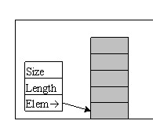
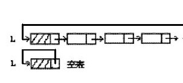

数据结构的很多概念真的是很莫名其妙，很多坑爹的定义，笔者开始很搞不明白，为什么学数据结构？为什么用哪个拗口词语？这些概念到底用在什么地方？笔者试图用自己简单的话来阐述这些问题，希望能对这些感觉不是很好理解的同学有帮助。

　　数据结构是算法的基石，算法是软件灵魂。

　　不废话，直接开始。

　　一、概论

　　  **时间复杂度**：就是算法实现的执行的时间，说白了就是程序套了好多循环。没有就是o(n),2层循环就是o(n2)，如此，剩下就不要管了。

　　　**空间复杂度**：说白了就是你定义了好多的变量，程序执行是额外使用了好多冗余内存。

　　　**算法标准**：什么算法是好的算法？好用就行。1、正确2、简单 3、占内存少 4、速度快 ，这几点不可兼得，自己把握，其实能简单和速度是主要的。

　　　二、线性表

　　　　顺序*存储结构    连续的存储*

　　　　

 　　　*链式存储结构　　　　　 内存中随机存储的，只需要指针写出下一个结点在哪里即可*

 

　　　　**线性表**：逻辑上不分叉就行。一个个数据元素前后相连（就是前驱、后继）。数据项平等对待。与此相对就是数、图。用途：其实就是数组啦。

　　　　**链表：**采用链式存储方式的线性表。什么是链式存储？就是一个数据项中不仅保存数据还要告诉下一个数据在哪里。用途：数据大小不确定时用。

　　　　从普通链表拓展的概念：

　　　　1、**循环链表**：首尾相连的链表；

　　　　2、**双链表：**前后相随的链表；前<  >后

　　　　　　用途：特殊情况加快链表的操作；

　　三、栈和队列

　　　　这个什么东西？就是功能被限制的链表，没有什么区别；

　　　　栈：只能从上面往下放，然后从上面去取；  就是一个坑啊，有木有！

　　　　　　　链栈：链式存储的栈；

　　　　　　　顺序栈：顺序存储的栈；

　　　　队列：前面装入数据，后面取出数据； 用途：保障时间的顺序，比如用户事务操作；

　　　　　　　链队列：链式存储的队列；  链队列：长度没限制啊，是不是、

　　　　　　　　　顺序队列：顺序存储的队列； 

　　四、串

　　　　　　就是把字符放到前面的线性表中。不然怎么叫字符串呢？ 所以很多语言字符串就是一个对象；

　　五、多维素组

　　　　　　素组的元素可以又是一个数组。 这个就是一个树。

　　六、树

　　　　　　有分叉的链表但是不能首尾相连；（线索二叉树除外，线索二叉树就是图了都）；

　　　　　　二叉树：最多两个分支。

　　　　　　深林：几个树放到一起（没连接哈），就是个深林；形象啊、

　　　　　　遍历：记住以根为标准即可，先访问根：先序；访问了左边，再访问根：中序；最后访问根：后序；

　　　　　　最优二叉树（哈夫曼树）：就是把权重的往上放。  用途：用来编码，用的多的，权重的自然放在前面了，权力大的就在上面（和金字塔的社会不是很像么？）；

　　　　　　线索二叉树：叶子节点的指针域不要浪费，指向其他，按照遍历的顺序来。其实就是一个图了。

　　　

　　七、图

　　　　　　无限个指针域，随你指向那个结点，不要重复就行。

　　　　　　无向图：指向a 被指向a,算作一样；

　　　　　　有向图：指向a被指向a,不同的，不一样；

　　　　　　带权:指向这个行为还有程度值，权值。

　　　　　　网络：带权的有向图。 路由协议中，由路由器组成的网络就是向且带权，比如速度、延迟不一样，上传、下载速度不一样；

　　　　　　遍历的问题有点麻烦

　　　　　　　　深度优先：就是一直往下走，不回头。

　　　　　　　　广度优先：一层一层剥下去。

　　　　　　生成树：把图滤成一个树。删除循环的连接；primus算法类似深度优先的思想，克鲁斯卡尔算法类似广度优先的思想；

　　　　　　最短路径：一个一个列出来，比较最小的；

　　八、排序和查找

　　　　　　**先看排序：**

　　　　　　1、冒泡排序：就像气泡一样，当前元素和下一个比，合适就这样，不合适就交换折腾 n * n次

　　　　　　2、快速：元素找到自己的排序位置，当每个人都找到了，那个顺序就定了。

　　　　　　3、选择：老实的排序法，找到最值，放在哪里，又去找最值。。。。

　　　　　　4、堆：和选择一样建一个具有堆的性质二叉树（节点永远比子节点大），堆顶就是最值，拿出来，再建一次堆。。。

　　　　　　7、插入：随便拿一个向有序的中放。问：开始没有有序的序列啊？答：开始只有找一个元素参照，一个必然是有序的，然后可以结合二分法查找，来排序，用查找的思想排序，逆天了有木有啊、

　　　　　　8、归并：几组有序的合并成一个。很简单，每人轮流拿出一个比较下，放进篮子里不就完了。

　　　　　　**排序好了才能查找，否则就只能一个一个查找了**

　　　　　　1、顺序查找：就是一个一个来；

　　　　　　2、二分法：简单，找中间，每次排除一半；

　　　　　　3、分块：建个索引，就是分割区域，这些区域对应到一个序列，例如123，然后去找，索引越细致，速度越快，但是修改了，会重建索引，把握程度即可。

　　　　　　4、二叉排序树：把数据存在一个树里，这个树的数据以中序遍历的顺序来存，这个结点的左边比右边小，就很好找了、每次排除整体的一半。

　　　　　　5、B-树：用二叉排序树当做索引存普通数据，因为二叉排序树的建立、删除代价太大了。

　　　　　　**什么是散列？**

　　　　　　举个栗子。。。。数据位1-100，怎么存?你可以用1-5（自己定哈），1-20划到1中，21-40划到2中。那么就是1-100的散列为1-5，

查找就很方便了，先看在那个区域里，再去找。可以说这是二分法的推广，二分法其实就是看做1-2的散列。

 

　　　　　　最后说几个问题：

　　　　　　1、排序用在数据库中的表记录上面，数据库必须要排序，就是在建立索引时发生的。大量的数据才会体现，排序算法的价值，可以用来节约钱啊。。。。。

　　　　　　2、数据库一般把索引文件和数据文件分开的。特别典型的就是MYSQL的MYISAM存储引擎。

　　　　　　3、所谓的存储引擎就是不通过的算法实现，采用不同的适合不同场合的算法，这些场合要求不同，比如有的要求速度，有的要求并发量大，可串行化。数据库采用具不同的存储引擎，对程序有很大的影响，且一定要合适。