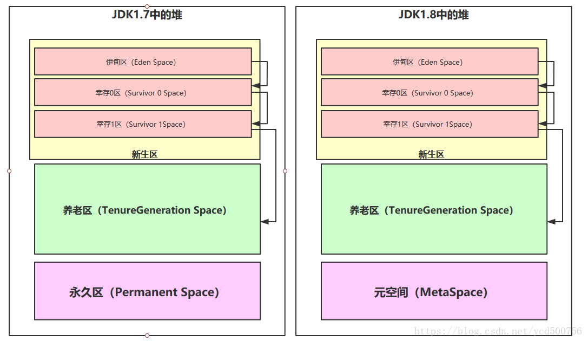
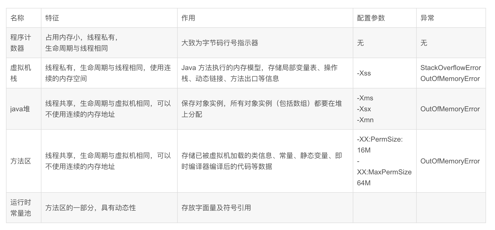

## 性能优化的维度

- 程序设计优化 
- Java 代码调优
- JVM 调优
- 数据库调优
- 操作系统调优

## 基准测试

- JMH Java 性能测试
- 数据性能测试


## 程序设计优化 

### 缓冲技术

缓冲技术用于协调不同系统之间的性能差异。例如文件流写入磁盘的速度慢，程序就会阻塞，缓冲像一个漏斗，先存放到内存，应用程序可以完成操作，缓冲慢慢释放内容到文件。缓冲可以大幅度提高 IO 效率。

#### BufferedWriter

用于包装 writer，构造函数的第二个参数可以指定缓冲区大小，默认为 8K。

```java
BufferedWriter bw = new BufferedWriter(new FileWriter(new File("test.txt"))) ;

bw.write("hello");
bw.write("world");

bw.flush();
bw.close();
```

#### BufferedOutputStream

用于包装输出流，构造函数的第二个参数可以指定缓冲区大小，默认为 8K。

```java
FileOutputStream fos=new FileOutputStream("test.txt");
BufferedOutputStream bos=new BufferedOutputStream(fos);
String content="hello world！";
bos.write(content.getBytes(),0,content.getBytes().length);
bos.flush();
bos.close();
```

### 缓存技术

不一定是所有从数据库读出的数据才需要缓存，很多数据都可以被缓存，例如网络请求、复杂计算，这些数据可以被零时缓存到内存中。


#### EhCache 进程内缓存

mybatis、shiro、hibernate 中的一级缓存都是 EhCache。默认内存缓存，可以配置为磁盘、外部介质。

远程 API 操作

```
// 1. 创建缓存管理器
CacheManager cacheManager = CacheManager.create("./src/main/resources/ehcache.xml");

// 2. 获取缓存对象
Cache cache = cacheManager.getCache("HelloWorldCache");

// 3. 创建元素
Element element = new Element("key1", "value1");

// 4. 将元素添加到缓存
cache.put(element);

// 5. 获取缓存
Element value = cache.get("key1");
System.out.println(value);
System.out.println(value.getObjectValue());

// 6. 删除元素
cache.remove("key1");
```

##### 使用Spring 注解操作

**@Cacheable**  

修饰的方法执行后就将返回值放入缓存，不再执行。表明所修饰的方法是可以缓存的，这个注解可以用condition属性来设置条件

```java
@Cacheable(value="UserCache", key="'user:' + #userId")    
public User findById(String userId) {    
    return (User) new User("1", "mengdee");           
}    
```

**@CacheEvict**

和 Cacheable 相反，执行后根据规则清空缓存。

```java
@CacheEvict(value="UserCache",key="'user:' + #userId")    
public void removeUser(User user) {    
    System.out.println("UserCache"+user.getUserId());    
}    
```


### 池化技术


#### 对象池

java中的对象池技术，是为了方便快捷地创建某些对象而出现的，当需要一个对象时，就可以从池中取一个出来（如果池中没有则创建一个），则在需要重复重复创建相等变量时节省了很多时间。

Java 中数据类型的包装类型支持基本的对象池技术。

#### 线程池

多线程可以充分利用多核 CPU 的使用率。使用线程池可以大幅度提高多线程性能，下面是一个线程池的例子，推荐使用 Executors 创建线程：

```java
ExecutorService executor = Executors.newFixedThreadPool(10);
executor.execute(new MyThread());
executor.shutdown;
```

线程池的数量非常重要，《Java 并发编程实践》中给出了一个公式

- Ncpu = CPU 的数量

- Ucpu = 目标 CPU 的使用率

- W/C = 等待时间与计算时间的比率

- Nthreads  = 合理的线程数量 

  

>  Nthreads = Ncpu * Ucpu * (1 + W/C)

#### 连接池

数据库连接池使用 C3P0、DBCP、HikariCP和Druid，spring 推荐使用 DBCP，但是 Druid 支持监控，可以对慢 SQL 进行分析。


## Java 代码调优

### 字符串优化

#### 优先使用字面量，而不是 new String();

```
String str = "";
// 优于
String str1 = new String();
```

#### 优先使用 StringTokenizer 分隔字符串

#### 只用 charAt 进行字符串比较

#### 优先使用 StringBuilder 和 StringBuffer

### 合理选用数据结构

####  列表

ArrayList 通过数组实现，每次扩容会造成大量的性能消耗，适合读多写少的操作，注意设置初始数组大小。

LinkedList 通过双向链表实现，查询效率低，写入速度快，适合写多读少。

Vector ArrayList 的线程安全实现，性能相差无几, 适合写多读少的场景。

CopyOnWriteArray 通过 COW 技术实现线程安全的实现，适合读多写少操作。


#### Map

HashMap 注意设置负载因子降低冲突

LinkedHaspMap 在读取时排序，内部基于链表，适合写多读少

TreeMap 实现了 sortedMap 满足对有序性的需求，在写入时排序，内部基于红黑树，适合读多写少

ConcurrentHashMap 是线程安全且高性能的额 Map 容器，使用了 CAS、红黑树、分段锁等技术。


####  Set

满足 Map 的无重复性需求

HashSet，对应 HashMap，基于hash的快速插入

LinkedHashSet，对应 LinkedHashMap，基于 hash 的插入，维护了插入集合的先后顺序个。按照先进先出的顺序排序

TreeSet，对应 Tree Map 基于红黑树的实现。有高效的元素 key 的排序算法


#### RandomAccess 随机访问接口

用于标记是是否支持随机访问，提高代码性能：

```
if(list isntanceof RandomAccess){
	// 随机访问
}else{
	// 老老实实使用迭代器 
}
```


### 使用 NIO 


TODO 


### 合理使用引用类型

#### 强引用

Java默认的引用方式，存在引用的情况下可以不会被回收。


#### 软引用

通过 SoftReference 使用软引用，当 内存达到一定阈值，GC会回收。


### 弱引用

GC 运行时会被回收，但是 GC 不会随时运行，因此可以利用这个特性实现某些缓存机制。

某些数据（缓存）放到一个超大的 map中会造成内存泄露，因此可以使用 WeakHashMap 来自动释放。


#### 虚引用


深入理解JAVA虚拟机一书中有这样一句描述：**“为一个对象设置虚引用关联的唯一目的就是能在这个对象被收集器回收时收到一个系统通知”。**

虚引用更多的是用于对象回收的监听。

1. 重要对象回收监听 进行日志统计
2. 系统gc监听 因为虚引用每次GC都会被回收，那么我们就可以通过虚引用来判断gc的频率，如果频率过大，内存使用可能存在问题，才导致了系统gc频繁调用


### 其他技巧


#### 少使用异常

#### 使用局部变量

局部变量在栈中，类变量在堆中。

#### 使用位运算

使用移位运算代替乘法除法（计算机实现原理）

#### 替换 switch

#### 一维数组代替二维数组

#### 使用 arrayCopy

#### 使用 Buffer 对 IO进行包装

#### 使用 clone() 代替new

clone 会绕过构造函数

#### 静态方法代替实例方法


## 并发调优

### 并发基础

#### volatile

线程会对变量局部更新，提高性能。volatile 变量可见性保证，这是并发编程的基础

- 其他线程对变量的修改，理解反应到当前线程中
- 确保当前线程对 volatile 的修改，能即时写回共享主内存中，并被其他线程所见
- 使用 volatile 声明的变量，编译器会保证有序性

#### 同步关键字 synchronized 

Java 中最基本的锁机制，可以锁方法、变量、类、静态方法等资源， synchronized 为公平锁。

#### 线程局部变量 ThreadLocal 

线程执行时独立的内存空间，在某些业务场景下可以用来实现并发操作，避免锁的使用。

#### 信号量 Semaphore

锁是对单个资源的控制，型号量可以对一组资源管理，例如 100 个线程的线程池，可以定义一个型号量 100，当型号量小于 100 时，请求才允许被加入。


### 锁优化

#### 锁的分类

- 乐观锁/悲观锁
  - 乐观锁：就是很乐观，每次去拿数据的时候都认为别人不会修改，所以不会上锁，但是在更新的时候会判断一下在此期间别人有没有去更新这个数据。典型的是使用版本号更新前判断。`update xxx when version =xxx;`如果版本号不匹配更新失败。在Java中 CAS 就是乐观锁。
  - 悲观锁：总是假设最坏的情况，每次去拿数据的时候都认为别人会修改，所以每次在拿数据的时候都会上锁。synchronized 就是悲观锁，mysql 中就是 readForUpdate 语句。
- 独享锁/共享锁
  - 独享锁是指该锁一次只能被一个线程所持有，例如 Synchronize、ReentrantLock。
  - 共享锁是指该锁可被多个线程所持有。
- 互斥锁/读写锁
  - 互斥锁在Java中的具体实现就是ReentrantLock。
  - 读写锁在Java中的具体实现就是ReadWriteLock、ReentrantReadWriteLock
- 可重入锁
  - 上锁后每个访问的线程都需要排队，可重入的意思是已经获取锁的线程再次进入无需排队，避免死锁。可重入锁又名递归锁，是指在同一个线程在外层方法获取锁的时候，在进入内层方法会自动获取锁。
- 公平锁/非公平锁
  - 公平锁是指多个线程按照申请锁的顺序来获取锁。ReetrantLock而言，通过构造函数指定该锁是否是公平锁，默认是非公平锁。
  - 非公平锁是指多个线程获取锁的顺序并不是按照申请锁的顺序，按照CPU运行时间片来划分的。ReetrantLock而言，通过构造函数指定该锁是否是公平锁，默认是非公平锁。Synchronized 也是一种非公平锁，无法变成公平锁。
- 分段锁
  - 分段锁其实是一种锁的设计，并不是具体的一种锁。ConcurrentHashMap而言，其并发的实现就是通过分段锁的形式来实现高效的并发操作。ConcurrentHashMap中的分段锁称为Segment，它即类似于HashMap（JDK7和JDK8中HashMap的实现）的结构，即内部拥有一个Entry数组，数组中的每个元素又是一个链表。当需要put元素的时候，并不是对整个hashmap进行加锁，而是先通过hashcode来知道他要放在哪一个分段中，然后对这个分段进行加锁，所以当多线程put的时候，只要不是放在一个分段中，就实现了真正的并行的插入。统计 Size 的时候需要全局加锁才能统计
- 偏向锁/轻量级锁/重量级锁
  - 这三种锁是指锁的状态，并且是针对Synchronized。
  - 偏向锁是指一段同步代码一直被一个线程所访问，那么该线程会自动获取锁。
  - 轻量级锁是指当锁是偏向锁的时候，被另一个线程所访问，偏向锁就会升级为轻量级锁，其他线程会通过自旋的形式尝试获取锁，不会阻塞。
  - 重量级锁是指当锁为轻量级锁的时候，另一个线程虽然是自旋，但自旋不会一直持续下去，当自旋一定次数的时候，还没有获取到锁，就会进入阻塞，该锁膨胀为重量级锁。
- 自旋锁
  - 在Java中，自旋锁是指尝试获取锁的线程不会立即阻塞，而是采用循环的方式去尝试获取锁，这样的好处是减少线程上下文切换的消耗，缺点是循环会消耗CPU。

#### AQS 技术

AbstractQueuedSynchronized 抽象队列式的同步器，AQS定义了一套多线程访问共享资源的同步器框架，许多同步类实现都依赖于它，如常用的ReentrantLock/Semaphore/CountDownLatch


想要获取锁的线程通过 CAS 设置资源计数器，当资源计数器为0时，队列开始移动，否则进行排队操作。


#### 避免死锁

死锁会造成线程挂起彼此等待，死锁可以 dump 出栈空间即可分析。

死锁产生的必要条件：


1. 互斥条件：一个资源每次只能被一个进程使用
2. 请求与保持条件：一个进程因请求资源被阻塞，对已经获得的资源保持不放
3. 不剥夺条件：进程获得的资源，在未使用完之前，不能强行剥夺
4. 循环等待等待条件：若干进程之间形成了一个等待资源的循环


常见的死锁就是分布式锁和数据库锁之间的的矛盾。


例如 数据库某行记录 A，某个变量 B，两个线程分别获得了锁，然后互相等待对方释放。


#### 减少锁持有时间和颗粒度

当锁不可避免时，应该减少锁的持有时间和颗粒度。


- synchronized 只锁变量不要锁类，注意 self  和 this的区别
- 数据库锁行，而不要锁表
- 使用分段锁减少锁的颗粒度


#### 使用读写分离锁来替换独占锁

读一般无需上锁，因此不应该将所有的请求都上锁，只对写上锁即可。


#### 锁分离思想

根据读写分离锁的思想，更新、删除或其他操作都可以分别上锁，而不是一个大锁。

例如 LinkedblockingQueue 基于链表，那么 take 和 put 操作可以分开上锁，减少锁竞争。


#### 合理使用重入锁和内部锁 （synchronized）

优先使用内部锁，减少编程复杂度，需要时再使用 ReentrantLock


#### 锁粗化 （Lock Coarsening）

锁粗化是相对于锁细粒度的另外一个极端情况的，当锁粒度过于细，反复获取锁也是不对的，应该保持适度。

在循环体中不应该使用锁，而是应该在循环体外使用锁，否则锁会反复被获取和释放。


####  开启 JVM 锁自璇

如果一个锁反复没有获取，线程切换的成本很高，还不如让它执行空循环（自旋）。


> =XX:+UseSpinning 

开启自旋


#### 开启 JVM 自动锁消除

有一些程序不必要使用锁，例如局部变量，JVM 可以优化为开启自旋锁。

> -server -XX:+DoEsccapeAnalysis -XX:+EliminateLocks 

开启逃逸分析和锁消除。


#### 开启锁偏向

如果没有发生竞争就进入锁偏向模式，关闭同步操作，用于优化不激烈的锁场景，这个优化场景意义不大。

> -XX:+UseBiasedLocking 


### 无锁并行计算设计


无锁的算法实际上就是一些乐观锁 CAS、COW等。

#### 原子操作

在 atomic 包下有一些原子操作类，大量使用 CAS 技术，非常有用。

例如 AtomicInteger.addAndGet() 通过一个无穷循环 CAS 直到成功。


#### Amino 框架

提供了一些成熟的无锁数据结构。


## JVM 调优

JVM 输出调试信息


> -XX:+PrintGCDetails


### 虚拟机内存模型

JVM 虚拟机模型


堆内存模型





####  程序计数器

#### 虚拟机栈

栈的大小决定了函数调用可达的深度，-Xss 设置栈的大小，一般无需设置此参数，应该消除递归代码

一般设置为 -Xss1M

另外，函数嵌套调用次数由栈的大小决定。栈越大，函数的嵌套调用次数越多。对一个函数而言，它的参数越多，内部局部变量越多，栈帧就越大，嵌套调用次数就会减少。

#### 本地方栈

本地方法栈为 java 原生函数调用使用的空间。

#### Java 堆

Java 堆为Java对象存储位置。采用分代内存回收策略：

- 新生代
  - eden 伊利园
  - s0 survior
  - s1 survior
- 老年代


使用 -XX 参数设置


#### 方法区

方法去也可称为永久区，主要存放常量和类的定义信息。


### JVM 内存分配参数


#### 设置最大堆内存

> -Xmx 

默认为物理内存的四分之一，一般可以开启到物理内存一致。


#### 设置最小堆内存

> -Xms

JVM启动会先按照最小堆内存运行，然后尝试运行时申请更多内存。如果最小堆内存过小，就会频繁触发 GC。

包括 Minor GC和Full GC。

JVM 会试图将内存尽可能限制在 -Xms 中。因此，当内存实际使用量初级 -Xms 指定的大小时，会触发 Full GC。因此 -Xms 值设置为 -Xmx 可以减少GC的次数和耗时。

这个操作的前提是，需要预知系统内存使用量。

#### 设置新生代

> -Xmn

设置一个较大的新生代会减少老年代的大小，这个参数对系统性能以及 GC 行为有很大的影响。新生代的大小一般设置为整个堆空间的 1/4 左右。


#### 设置持久代

> -XX:MaxPerSize

持久代（方法区）不属于堆的一部分，持久代决定了系统可以支持多少个类定义和多少常量。如果使用了 CGlib 或者 Javassist 等动态字节码技术的程序，需要合理设置。

一般来说，设置为 64M 已经够用，如果出现溢出，可以设置为  128M。

如果 128M依然不能满足，不应该继续增加参数值。而是优化程序设计。

#### 设置线程栈

> -Xss 

线程栈是线程的一块私有空间，决定了支持线程的数量。

如果线程栈的空间很大，则允许支持的线程数量就会减少，因此这个值需要合理设置。

由于堆的增加会挤占栈空间的大小，因此设置这个参数需要和堆大小合理取舍。

#### 堆的比例分配

新生代和S区域的比例

> -XX:SurviorRation=eden/s0=eden/s1


#### 堆参数设置总结



- -Xms：初始堆大小
- -Xmx：最大堆大小
- -Xss：线程栈的大小
- -XX：NewSize：设置新生代大小
- -XX：PermSize：永久区的初始值
- -XX：MaxPermSize：永久区的最大值
- -XX：MinHeapFreeRatio：设置堆空间最小空闲比例
- -XX：MaxHeapFreeRatio：设置堆空间最大空闲比例
- -XX：NewRatio：设置老年代与新生代的比例
- -XX：SurviorRatio：新生代中eden区域survivior区的比例


### 垃圾收集基础


TODO 


### 调优方法


### 实用的 JVM 参数


#### 开启 JIT 编译参数

> -XX:CompileThreadhold

设置阈值，Java 代码进入 JIT 编译模型。

#### 堆 dump

> -XX: + HeapDumpOnOutOfMemoryError 

内存溢出时，dump 堆内存信息，还可以设置导出的位置

> -XX: HeapDumpPath 

#### 发生 OOM 时候执行一段脚本

> -XX: OnOutOfMemoryError=./restart.sh

可以在发生内存溢出时候重启服务, 或者通知


