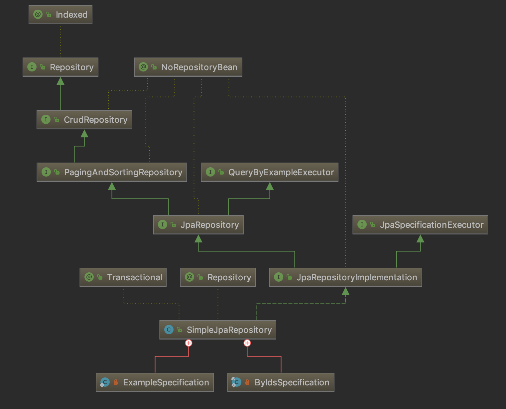

## Spring、Spring data 和 Spring data JPA 的关系

Spring data JPA 是 Java 服务器开发中最容易混淆的一堆概念。

- Spring，众所周知是一个轻量级的 IOC 容器，用来处理对象实例（Bean）之间的关系。
- Spring data，是 Spring Framework 生态下用来访问数据的一个模块。
- JPA，是 Java persistence API 的缩写，Java 用来抽象访问数据库的规范，主要实现有 Hibernate、TopLink 等 ORM 库。
- Spirng data JPA，是 Spring data 项目的一个主要模块，用来封装 JPA 实现，并增加了一些便利的方法。如果直接使用 Hibernate 还是需要编写类似于 SQL 的 JPQL 的查询语言。但使用 Spring data JPA 可以实现类似 `findById()` 一类基本操作的方法。

Spring Data 的一些属于版本火车的子项目：

- Spring Data Commons
- Spring Data JPA
- Spring Data KeyValue
- Spring Data LDAP
- Spring Data MongoDB
- Spring Data Redis
- Spring Data REST
- Spring Data for Apache Cassandra
- Spring Data for Apache Geode
- Spring Data for Apache Solr
- Spring Data for Pivotal GemFire
- Spring Data Couchbase (community module)
- Spring Data Elasticsearch (community module)
- Spring Data Neo4j (community module)
  
版本火车指的是，不同的独立子项目会保持同步的发布节奏，如果使用 Spring boot，也会随着 parent pom 变化，避免版本不一致导致的问题。

## Spring Data JPA 主要特性

- 辅助查询 `findByxx`
- 支持使用 Querydsl 复杂统一的查询方法
- 分页、排序
- 启动时检查 `@Query` 有效性

## Spring Data JPA 的主要类

从 SimpleJpaRepository 的实现开，使用 idea 分析出类图。




## 快速入门教程

https://spring.io/guides/gs/accessing-data-jpa/

## 常见的查询方法

查询方法策略就是Spring Data如何从 repository 中找到合适的查询方法。有一下几种

- CREATE 尝试从查询方法名称构造特定于仓库的查询。例如 findByName，根据约定有以下几种查询方式：
    -  find…By
    -  read…By
    -  query…By
    -  count…By
    -  get…By
- USE_DECLARED_QUERY 会从 repository 中定义的方法中寻找合适的查询方式
- CREATE_IF_NOT_FOUND 这是 JPA 默认的策略，组合CREATE和USE_DECLARED_QUERY


CREATE 策略的几个例子：

```
interface PersonRepository extends Repository<User, Long> {

  List<Person> findByEmailAddressAndLastname(EmailAddress emailAddress, String lastname);

  // Enables the distinct flag for the query
  List<Person> findDistinctPeopleByLastnameOrFirstname(String lastname, String firstname);
  List<Person> findPeopleDistinctByLastnameOrFirstname(String lastname, String firstname);

  // Enabling ignoring case for an individual property
  List<Person> findByLastnameIgnoreCase(String lastname);
  // Enabling ignoring case for all suitable properties
  List<Person> findByLastnameAndFirstnameAllIgnoreCase(String lastname, String firstname);

  // Enabling static ORDER BY for a query
  List<Person> findByLastnameOrderByFirstnameAsc(String lastname);
  List<Person> findByLastnameOrderByFirstnameDesc(String lastname);
}
```

- 表达式通常是属性遍历和可以连接的运算符。您可以使用组合属性表达式AND和OR。您还可以得到这样的运营商为支撑Between，LessThan，GreaterThan，和Like该属性的表达式。受支持的操作员可能因数据存储而异，因此请参阅相应部分的参考文档。

- 方法解析器支持IgnoreCase为单个属性（例如，findByLastnameIgnoreCase(…)）或支持忽略大小写的类型的所有属性（通常为String实例 - 例如findByLastnameAndFirstnameAllIgnoreCase(…)）设置标志。支持忽略情况的方式可能因商店而异，因此请参阅参考文档中的相关部分以获取特定于商店的查询方法。

- 您可以通过OrderBy向引用属性的查询方法附加子句并提供排序方向（Asc或Desc）来应用静态排序。

分页的情况
```
Page<User> findByLastname(String lastname, Pageable pageable);

Slice<User> findByLastname(String lastname, Pageable pageable);

List<User> findByLastname(String lastname, Sort sort);

List<User> findByLastname(String lastname, Pageable pageable);

```

## 一对多级联存储

一对多的级联存储时，需要配置好关联关系，然后将自增ID置空即可。

```
 Feature ageFeature = new Feature();
        ageFeature.setName("年龄");
        ageFeature.setStep(2);

        ageFeature.setFeatureValues(Arrays.asList(
                new FeatureValue(null, "10-20", ageFeature),
                new FeatureValue(null, "20-30", ageFeature)
        ));
        return ageFeature;
```


## UUID 生成策略

```
    @Id
    @GeneratedValue(generator = "UUID")
    @GenericGenerator(name = "UUID", strategy = "org.hibernate.id.UUIDGenerator")
    private String id;

```

## 常用注解

### Enumerated 

```
    @Enumerated(STRING)
    private AccountRoles role;
```

可以将字符串类型变成枚举类型。

## 一些坑

1. @ManyToOne 如果 one 这一方不存在，会报错，即使设置了 Optional
2. 应该使用 DDD 思想去设计关联，禁止双向关联
3. @OneToMany 关系默认懒加载会报错，应该设置为 Eager，或者使用 @Transactional 但是会带来性能开销
4. @OneToOne 本质上是实体和值对象的关系，统一使用实体的ID
5. @ManyToMany 默认会删除关联表
6. @Save  时候如果外键在对应表中，找不到目标记录会丢出错误,例如用户属于某个部门,拥有多个 Role

```

{
  username:"",
  department:{
    id: 1
  },
  roles:[
    {
      id:1
    }
  ]
}

```
当 role 的 ID 在数据库中不存在时，会报错，需要处理异常。

7. 当数据库插入异常，会报错，例如违反主键规则
8. 更新、插入，只要不报错都会返回成功，无需再检查返回值


## JPA 和建表规范

- 根据 DDD 原则建表
  - 例如 user user_avatar user_role

## 性能优化

1. 不要有一些无意义的关联
2. 使用 NamedEntityGraph 帮我们一次抓取数据，可以明显减少 SQL 数量

## 参考资料

-  示例项目 https://github.com/spring-projects/spring-data-examples/tree/master/jpa
-  Spring data  中文版本 https://blog.csdn.net/yongboyhood/article/details/81226553
-  JPA 教程 https://www.yiibai.com/jpa/jpa-introduction.html

