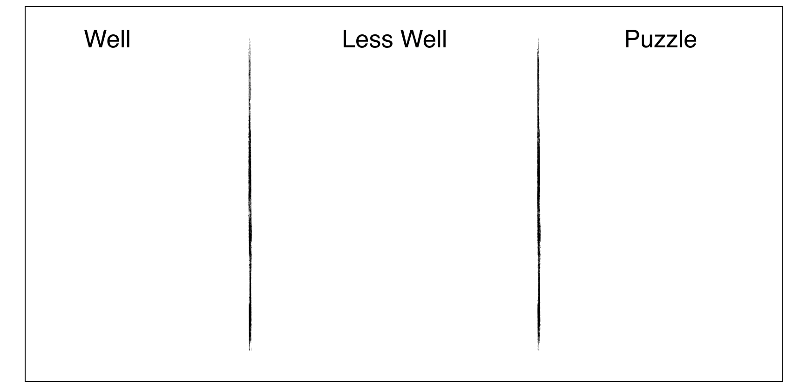

Retro 是敏捷软件开发方法中的一种会议形式，Retro 这个单词的全称是 Retrospective，意为回顾、审查。Retro 这种会议形式适用于某个项目完成后，或任务进展到某一个阶段时对之前的工作进行复盘、检查。

这种会议形式在海外的公司中非常流行，可能发生在某一次培训完成后，发现培训中的问题进行改进；那些做的好的实践，以便于继续坚持；或者挖掘团队中的金点子和建议。

所以在会议中，要求全员积极参与，一般来说聚焦于3个问题：

1. 那些实践对我们非常有帮助？
2. 那些事例对团队或项目造成不良影响？
3. 在工作期间有什么疑惑或者问题？

举例来说，在一个培训项目完成后的 Retro 会议可能会收集到如下的清单：

Well：

1. 记住每个学员的名字
2. 持续和学员沟通
3. 在每次课程前强调纪律（Ground Rule）
4. PPT上的字足够大

Less Well：

1. 每天结束前没有及时总结
2. 没有足够的答疑时间
3. 没有布置作业

于是，根据 Less well 中的条目，制定改进行动：

1. 在课程计划中添加每日总结的内容
2. 使用Parking Lot（停车场，一张大白纸放置学生疑问的便利贴）收集没有及时回复的问题，在其余时间回复
3. 设计作业和批改作业

因此只要坚持，使用 Retro 这种会议形式，随着项目的进行，就会有足够多的培训经验被积累下来。这就是 Retro 的魅力， Retro 本身只是一种形式，但是提供了一种持续改进的方法。

当然，Retro 也不一定限于这三个方面，也有一些其他的 Retro 形式。例如从项目的风险角度出发，一种有趣的 Retro形式 《Anchors and Engine》：

1. 有那些风险或者阻碍项目进行的事情（Anchors）?
2. 有哪些在促使项目往好的方向发展的（Engine）？

你可以在 [funretrospectives.com](http://www.funretrospectives.com/anchors-and-engine/) 的网站上找到类似更多的Retro形式。

## 操作方法

常用的 Retro 具体的操作方法有两种，一种是主持人白板上画出制定区域，参与者通过报事贴发布自己的想法；另一种是通过一些在线工具让参与者更为方便的参与Retro。

这里给出便利贴的操作方法，在线工具的方法大同小异，并使用最基本的回顾模型（Well、Less well、Puzzle）。一般 Retro 的时间在30-60分钟，需要相关的人员全部都参与，其中需要一个主持者全程引导。

下面是具体的操作步骤：

1. 主持人在白板上书写 Well、Less well、Puzzle 三列。
2. 主持人回顾上次 Retro 的行动执行情况。
3. 所有参与者在5分钟内书写报事贴，并贴到白板上，每个报事贴只书写一项内容。
4. 主持人对所有报事贴分类，把相同和类似的内容贴到一起。
5. 所有人员需要讨论 Less well 的内容，得出行动，但限于时间原因主持人决定讨论的数量，一般 3 - 5项。
6. 所有人员使用“正”字计数法，对分组后的内容进行投票。
7. 团队逐个讨论 Less well，找到可以采取的行动。例如在某次教学活动中，物料准备不够充分，我们可以采取的行动应该是，每一次教学应该有专人根据物料清单检查物料情况。
8. 得出的行动应该指派到专人负责，否则没有意义。

（一个最普通的 Retro 模式）

在线的操作流程类似，可以使用 https://ideaboardz.com/ 等相关工具用用电子话的方式进行 Retro。

## 注意事项

1. 在 Retro 开始前，如果是新组建的团队，有可能有团队成员处于某些原因，不放心说出自己真实感受和问题，可以进行安全度检查。具体操作方法是进行匿名投票，使用便利贴书写 “安全” “不安全” 然后由主持人统计查看。如果团队中存在感受到不安全的成员出现，让参与者中职级最高的参与者离开，然后再次投票，直到安全为止。
2. 如果有参与者认为团队环境不安全，无法畅所欲言，不去解决不安全因素而直接开始，Retro 的效果会只能是形式化的，对项目的推动没有意义。
3. Retro 很重要的一个点是持续坚持，如果只做一次 Retro 实际上意义不大。如果一个团队定期都会举行 Retro，那么团队成员就会时刻准备下一次 Retro 可以讨论的问题。
4. Retro 中产出的行动需要有专人负责，即使有些行动是针对团队所有人，但需要有专人负责提醒、检查。