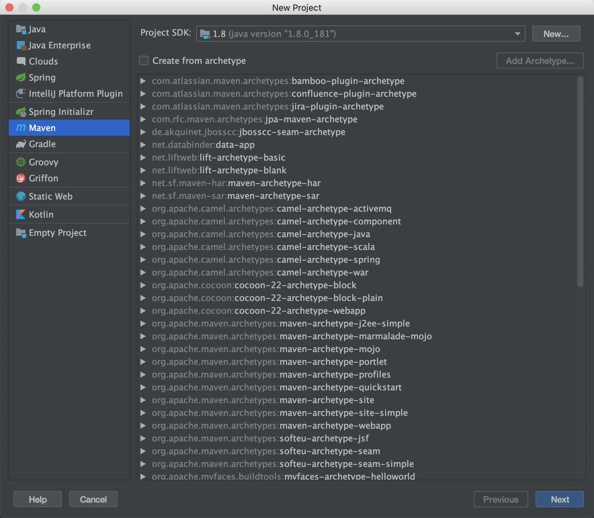
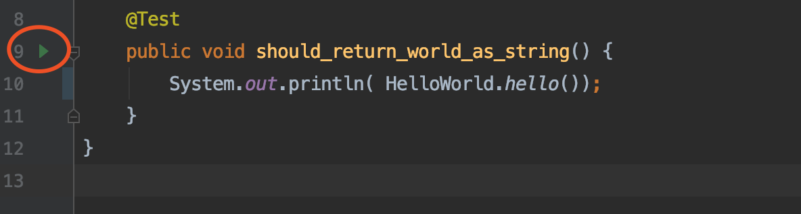

[TOC]


##  单元测试基础


### 什么是单元测试?


> 在计算机编程中，单元测试（英语：Unit Testing）又称为模块测试，是针对程序模块（软件设计的最小单位）来进行正确性检验的测试工作。 ——维基百科 


什么是一个单元？


在过程化编程中，一个单元就是单个程序、函数、过程等；对于面向对象编程，最小单元就是方法，包括基类（超类）、抽象类、或者派生类（子类）中的方法。


因此“单元”是一个相对概念，因此对方法、类、模块、应用都可以被当作单元测试。简单来说，单元测试的初衷是对应用的一小部分及时的测试，而非等到所有的代码编写完成启动整个应用测试。


通常来说来说单元测试是在类、方法这个层面而言。与之相对的是集成测试、E2E 测试。


### 为什么需要写单元测试？


在没有接触单元测试之前我们是怎么做测试的？一般有两个方法：


1. 启动整个应用，像用户正常操作一样。点击界面按钮，调用一个 API 等。手动测试的坏处是每次测试都得启动整个应用，项目稍微一大非常慢，PHP、Nodejs 还好，尤其是 Java、C++ 这种编译型语言非常痛苦。


2. 在代码某个地方写一个临时入口，例如 java 的 main 方法，测试某个方法或者某个类，用完留在项目中或者删除。如果不删除的话会让项目变得很乱，删除的话下次想测试又得弄个新得。


这两个方法都有一个共同得不足，没法保留测试数据的创建过程，场景、边界的覆盖基本随缘。
单元测试本质上就是方法 2，把类似 main 方法的测试代码统一放到一个地方。然后根据一些约定，让代码更加简洁。但不强制你把测试代码放到任何一个地方。


根据约定：


- test 代码单独放到 src/test 目录下，与 src/main 一一对应
- 测试类和源代码保持同名+Test 后缀


理论上不使用任何测试框架也可以完成编写单元测试，最初的单元测试也是这样。不过好在现在可以利用 xUnit 等框架更方便的运行测试。使用框架的单元测试好处有：


- 通过 Runer 可以批量运行
- 使用 @Before 等钩子实现数据准备、数据清理
- 通过断言实现结果的验证，避免人工确定结果的正确性
- 通过覆盖率统计工具，统计代码测试覆盖率
- 通过 Mock 解决代码相互依赖的问题


当然，编写单元测试的目的除了测试方便之外，还有一个重要的用途：重构。


某些场景下，你需要改造一些遗留代码，并接近 100% 兼容原来的逻辑，没有单元测试保护的情况下，没人敢改，造成代码越来越混乱。通过单元测试对原来的业务逻辑进行覆盖，在有保护的情况开始重构，重构完成后再次运行单元测试，如果能通过测试说明基本上没有破坏性改动。


这是单元测试非常重要的一个用途。


Junit 是 Java 的单元测试套件，我们可以从最简单的单元测试开始对 Java 的一个方法进行验证，而不必启动整个应用。 


### 搭建环境

我们选用 Junit4 作为本教程的测试框架，除了 Junit 之外 Java 生态的测试框架还比较多，Junit4 是目前最主流也是搭建最为简单的测试框架之一。


我假定你已经有 Java 开发经验，并有 JDK、Intellij IDEA、Maven 工具，如果你使用 Eclipse、Gradle 可以先花一点时间了解Intellij IDEA、Maven 两个工具，它们都是非常简单并且容易使用的。


你可以通过 File -> New -> Project，然后选择 Maven 标签页创建一个项目。





使用 Junit 只需要在 pom.xml 文件中的 dependencies 节点添加依赖：


```xml
<dependency>
    <groupId>junit</groupId>
    <artifactId>junit</artifactId>
    <version>4.13</version>
    <scope>test</scope>
</dependency>
```


注意 scope 选择为 test，这样在打出的软件包中会自动排除 Junit 的 jar 包。如果在创建 Maven 项目的过程中遇到困难，可以参考代码示例：https://github.com/linksgo2011/java-unit-test-demos


### 给  Hello, world! 写一个单元测试

大部分人学习编写的第一个程序就是 《Hello, world!》，通过编程语言简单输出字符串 Hello, world!，代表学会了第一个程序，也标志着编程环境搭建成功。


我们编写一个类，有一个静态方法，输出一个字符串：”Hello, world!“：

```java
public class HelloWorld {
    public static String hello() {
        return "Hello, world!";
    }
}
```

静态方法是最容易测试的方法之一，一般是一些 Util 方法。工作中，我经常看到很多人，在静态方法附近编写了一个 main 函数，然后调用这个方法来测试。


```java
public static void main(String[] args){
    System.out.println(hello());
}
```


就像我们前面说的，这种方式就是一种朴素的单元测试思想。我们可以使用一个测试类和 @Test 注解代替 main 函数作为启动入口。我们创建一个 类 HelloWorldTest 添加一个 public 方法，然后添加 @Test 注解，这个时候 IDE 会自动识别这是一个可执行的测试，我们在这个方法内调用被测试的静态方法，并打印出来。


```java
public class HelloWorldTest {
    @Test
    public void should_return_world_as_string() {
        System.out.println( HelloWorld.hello());
    }
}
```


点击左侧的执行按钮，可以像 main 函数一样执行它，并得到同样的输出结果。使用单元测试会更整洁，并拥有更强的描述性。





按道理说，你的第一个单元测试便写好了。不过这个时候，你是通过肉眼每次判断程序输出是否正确，当有几十上百个测试用例运行时，难以判断你的结果是否正确。


因此我们需要在测试的代码中，定义出来什么是对的什么是错的，于是我们需要用到断言。


### 断言

计算机是一个特别讲究准确的机器，计算机程序要求务必准确。往往少了一个符号或者单词拼写错误就会让程序出现意想不到的结果，我相信多少人一个单词拼写错误就 debug 了一整天，最后发现是一个非常蠢的问题。


我是一个不是很细心的人，吃过不少这方面的苦头。初次学习 C/C++ 总是忘记输入行末的分号，直到编译时候才提示我错误，我的网名 “少个分号” 就是这样而来。


类似的，我们在编写应用程序时希望一个字符都不要错。单元测试可以帮我们检查程序的输入是否正确，并重复运行，**就需要告诉单元测试什么是对的，什么是错误的，这就是断言。**


在一些”讲究“的程序员眼里，"Hello, world!" 是神圣的，”H“ 需要大写，中间有逗号隔开，并且以感叹号结束。我们来编写第一个断言，删除 System.out.println 语句，使用 assertEquals 代替。


```java
    @Test
    public void should_return_world_as_string() {
        Assert.assertEquals("Hello, world!", HelloWorld.hello());
    }
```


assertEquals 方法的第一个参数是期望的值，第二参数是真实的值。如果这两个值相等，测试通过，控制台为绿色。


### 测试异常
### 准备数据和清理数据
### 设计一个好的用例


### 使用 Idea 查看测试覆盖情况

### 一些约定和技巧


1. 快捷键
2. 一些规范
3. junit4 中 非 public 方法会不被识别


### 总结


## 为 Spring 应用编写测试


### 认识 Runner
### SpringJUnit4ClassRunner
### Mock
### verify
### 加载 classpath 文件


## Spring boot 测试实践
### @SpringBootTest 注解
### 加载测试配置
### 内嵌数据库
### 内嵌 Redis
### 测试分层概念
### 测试领域层
### 测试控制器


## 测试静态、私有方法


### powermock 入门


## TDD和重构 


## 单元测试高级


### 工程化
### jcoco
### 测试性能
### 多线程和并发
### junit5 的使用


## 参考资料

- 《Java 测试驱动开发》 https://www.zhihu.com/pub/book/119564880