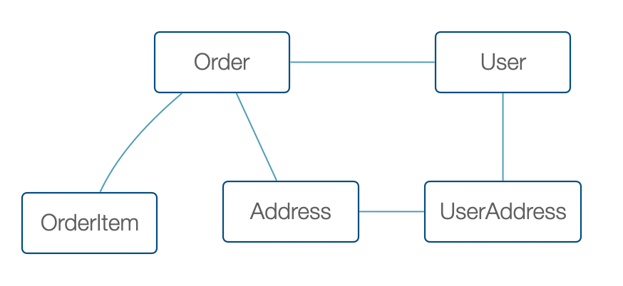

## 1. 理解聚合根

聚合是一组始终需要保持一致的业务对象。因此，我们作为一个整体保存和更新聚合，以确保业务逻辑的一致性。

聚合根是 DDD 中最为重要的概念，即使你不使用 DDD 编写代码也需要理解这一重要的概念 —— 部分对象的生命周期可以看做一个整体，从而简化编程。

一般来说，我们需要对聚合内的对象使用 ACID 特性的事务。

 最简单的例子就是订单和订单项目，订单项目更新必须伴随订单的更新，否则就会有总价不一致之类的问题。订单项目需要跟随订单的生命周期，我们把订单叫做聚合根，它就像一个导航员一样


 ```java
class Order {    
	private Collection<OrderItem> orderItems;   
	private int totalPrice;   
}

class OrderItem {
	private String productId;   
	private int price;   
	private int count; 
}
 ```

Order 的 totalPrice 必须是 OrderItem 的 price 之和，还要考虑折扣等其他问题，总之对象的改变都需要整体更新。

理想中最好的方式就是把聚合根整体持久化，不过问题并没那么简单。

## 2. 聚合持久化问题

如果你使用 MySQL 等关系型数据库，集合的持久化是一个比较麻烦的事情

1. 关系的映射不好处理，层级比较深的对象不好转换。
2. 将数据转换为聚合时会有 n+1 的问题，不好使用关系数据库的联表特性。
3. 全量的数据更新数据库的事务较大，性能低下。
4. 其他问题

聚合的持久化是 DDD 美好愿景落地的最大拦路虎，这些问题有部分可以被解决而有部分必须取舍。

聚合的持久化到关系数据库的问题，**本质是计算机科学的模型问题**。

聚合持久化是面向对象模型和关系模型的转换，这也是为什么 MongoDB 没有这个问题，但也用不了关系数据库的特性和能力。

面向对象模型关心的是业务能力承载，关系模型关心的是数据的一致性、低冗余。描述关系模型的理论基础是范式理论，越低的范式就越容易转换到对象模型。

理论指导实践，再来分析这几个问题：


**“关系的映射不好处理”** 如果我们不使用多对多关系，数据设计到第三范式，可以将关系网退化到一颗树。



<center>△ 网状的关系 </center>


<center>△ 树状的关系 </center>

**"将数据转换为聚合时会有 n+1 的问题"** 使用了聚合就不好使用集合的能力，列表查询可以使用读模型，直接获取结果集，也可以利用聚合对缓存的优势使用缓存减轻 n+1 问题。

**"全量的数据更新数据库的事务较大"** 设计小聚合，这是业务一致性的代价，基本无法避免，但是对于一般应用来说，写和更新对数据库的频率并不高。使用读写分离即可解决这个问题。


## 3. 自己实现一个 Repository 层

如果你在使用 Mybatis 或者使用原生的 SQL 来编写程序，你可以自己抽象一个 Repository 层，这层只提供给聚合根使用，所有的对象都需要使用聚合根来完成持久化。

一种方式是，使用 Mybatis Mapper，对 Mapper 再次封装。

```java
class OrderRepository {
	private OrderMapper orderMapper;
	private OrderItemMapper orderItemMapper;
  
	public Order get(String orderId) {
		Order order = orderMapper.findById(orderId);
		order.setOrderItems(orderItemMapper.findAllByOrderId(orderId))
		return order;
	}
}
```

这种做法有一个小点问题，领域对象 Order 中有 orderItems 这个属性，但是数据库中不可能有 Items，一些开发者会认为这里的 Order 和通常数据库使用的 OrderEntity 不是一类对象，于是进行繁琐的类型转换。

类型转换和多余的一层抽象，加大了工作量。

如果使用 Mybatis，其实更好的方式是直接使用 Mapper 作为 Repository 层，并在 XML 中使用动态 SQL 实现上述代码。

还有一个问题是，一对多的关系，发生了移除操作怎么处理呢？

比较简单的方式是直接删除，再存入新的数组即可，也可以实现对象的对比，有选择的实现删除和增加。

完成了这些，恭喜你，得到了一个完整的 ORM，例如 Hibernate 。

## 4. 使用 Spring Data JPA

所以我们可以使用 JPA 的级联更新实现聚合根的持久化。

大家在实际操作中发现，JPA 并不好用。

其实这不是，JPA 的问题，是因为 JPA 做的太多了，JPA 不仅有各种状态转换，还有多对多关系。

如果保持克制就可以使用 JPA 实现 DDD，尝试遵守下面的规则：

1. 不要使用 @ManyToMany 特性
2. 只给聚合根配置 Repository 对象。
3. 避免造成网状的关系
4. 读写分离。关联等复杂查询，读写分离查询不要给 JPA 做，JPA 只做单个对象的查询


```java
class Order {    
	@Id
	@GeneratedValue(strategy = GenerationType.AUTO)
	private String id;

	@OneToMany(cascade = CascadeType.ALL, fetch = FetchType.LAZY)
	@JoinColumn(name = "order_id")
	private Collection<OrderItem> orderItems;   
	private int totalPrice;   
}

class OrderItem {
	@Id
	@GeneratedValue(strategy = GenerationType.AUTO)
	private String id;
	private String productId;   
	private int price;   
	private int count; 
}
```


## 5. 使用 Spring Dat Jdbc


## 6. 使用 Domain Service 变通处理


